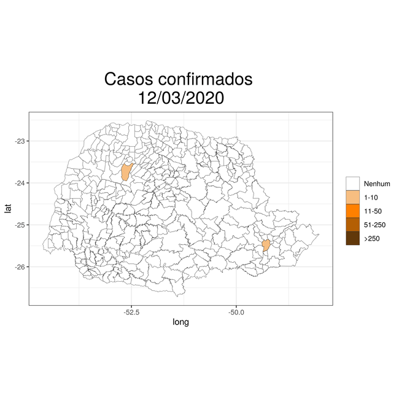
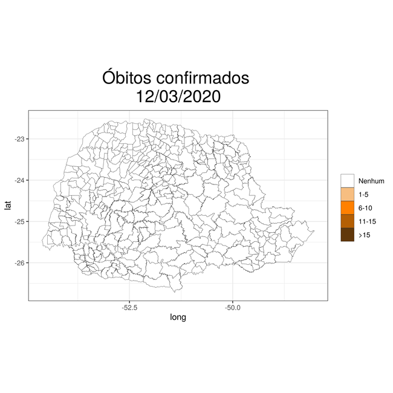

```{r, echo=FALSE, warning=FALSE, results='hide'}

source('gera_gif_pr.R')

library(flexdashboard)
library(tidyverse)    # programação eficiente
library(stringr)      # tratamento de strings
library(gifski)       # geração de gifs a partir de um conjunto de pngs
library(sp)           # classes e métodos para dados espaciais
library(maptools)     # ferramentas para lidar com objetos espaciais temáticos
library(plotly)       # graficos dinamicos

#--------------------------------------------------------------
dh <- as.character(Sys.time())

dia <- format(as.Date(substr(dh,1,10)), "%d/%m/%Y")

hora <- substr(dh,12,20)
#--------------------------------------------------------------

dados_br <- read.csv('https://raw.githubusercontent.com/wcota/covid19br/master/cases-brazil-cities-time.csv',
                     sep = ',', header = T)

dados_br$ibgeID <- as.character(dados_br$ibgeID)
#--------------------------------------------------------------

tabela_br <- dados_br[,c(1,3,4,6,7,8,9)]

tabela_br$date <- as.Date(tabela_br$date)

data <- last(tabela_br$date)

tabela_br <- subset(tabela_br, date == data)

tabela_br <- tabela_br[, c(2,3,7,5)]

names(tabela_br) <- c('Estado',
                      'Município', 
                      'Total de casos', 
                      'Total de óbitos')

tabela_br <- plyr::arrange(tabela_br, 
                           desc(tabela_br$`Total de casos`))

```


Sobre este material {data-icon="fa-file-alt" data-navmenu="Apresentação"}
===================================== 

Column {data-width=125}
-----------------------------------------------------------------------

### Data de atualização {.value-box}

```{r}

  valueBox(
    value = dia,
    icon = "fa-calendar"
    #,color = 'teal'
  )
```

### Hora de atualização {.value-box}

```{r}

  valueBox(
    value = hora,
    icon = "fa-clock"
    #,color = 'teal'
  )
```

### Casos no Brasil {.value-box}

```{r}

valueBox(as.numeric(subset(tabela_br, Município =='TOTAL')[3]), 
         icon = "fa-hospital"
         #,color = 'orange'
         )

```

### Óbitos no Brasil {.value-box}

```{r}

valueBox(value = as.numeric(subset(tabela_br, Município =='TOTAL')[4]), 
         icon = "fa-procedures"
         #,color = 'red'
         )

```

### Casos no Paraná {.value-box}

```{r}

valueBox(sum(subset(tabela_br, Estado =='PR')[,3]), 
         icon = "fa-hospital"
         #,color = 'orange'
         )

```

### Óbitos no Paraná {.value-box}

```{r}
valueBox(value = sum(subset(tabela_br, Estado =='PR')[,4]), 
         icon = "fa-procedures"
         #,color = 'red'
         )

```

Column {data-width=875}
-----------------------------------------------------------------------

### 

<style>
body {
  padding: 50px 0px 0px 0px;
  <!--color: #000000-->
}

</style>

<center>
<table><tr>
<td>  </td>
</tr></table>
</center>

---

<center>
<font size="5"> 
<p align=”center”> <b> Monitoramento COVID-19  </b> </center>
</font>
</center>

---

#### COVID-19

A COVID-19 é uma doença causada pelo coronavírus SARS-CoV-2, descoberto em 31/12/19 após casos registrados na China. De acordo com a Organização Mundial de Saúde (OMS), cerca de 80% dos infectados podem ser assintomáticos e cerca de 20% podem requerer atendimento hospitalar por apresentarem dificuldade respiratória. Na prática, trata-se de um vírus com letalidade baixa mas altamente contagioso e que, até o momento, não há vacina. Portanto, caso a disseminação não seja devidamente controlada, é uma doença capaz de levar sistemas de saúde inteiros ao colapso como ocorreu em diversos países do mundo.

Os sintomas da COVID-19 podem variar de um simples resfriado até uma pneumonia severa. A transmissão acontece por meio de toque (na pessoa ou em superfície contaminada), gotículas de saliva, espirro, tosse, catarro, etc. O diagnóstico é feito através de exames laboratoriais.

---

#### Sobre esta página

O objetivo desta página é explorar e apresentar alguma análise descritiva dos dados a respeito do COVID-19 no Brasil com ênfase nos municípios do Paraná, especialmente, em Curitiba. O conteúdo varia desde gráficos estáticos com as curvas de casos confirmados e óbitos até mapas e dinâmicos.

Os [dados utilizados](https://covid19br.wcota.me/) para análise foram contabilizados a partir de boletins das secretarias estaduais e da plataforma oficial do Ministério da Saúde. Utilizou-se, principalmente, a base de [casos no Brasil por município]('https://raw.githubusercontent.com/wcota/covid19br/master/cases-brazil-cities-time.csv') que dispunha de informações como: data, estado, município, casos e óbitos de forma cumulativa e diários.

Este material foi altamente motivado pela iniciativa [Portal COVID19](http://covid.c3sl.ufpr.br/) do [Setor de Ciências Exatas](http://www.exatas.ufpr.br/portal/) da [Universidade Federal do Paraná (UFPR)](https://www.ufpr.br/portalufpr/). O portal tem por objetivo agregar informações atualizadas, modelos estatísticos, visualizações de dados e links úteis sobre a pandemia COVID-19 no Brasil, mais especialmente no Estado do Paraná. O conteúdo disponibilizado é um esforço conjunto de pesquisadores dos Departamentos de Estatística, Informática, Física, Matemática e Saúde da Universidade Federal do Paraná e pesquisador do Insper-SP, com o apoio da Direção do Setor de Ciências Exatas da UFPR.

---

#### Links interessantes

<table><tr>

<td>  
 - [Dados utilizados nesta página](https://github.com/covidbr/covidbr.github.io)
 - [Número de casos confirmados de COVID-19 no Brasil](https://covid19br.wcota.me/)
 - [Portal COVID19 — Setor de Ciências Exatas/UFPR](http://covid.c3sl.ufpr.br/)
 - [Ministério da Saúde](https://coronavirus.saude.gov.br/)
 - [Secretaria de Saúde do Paraná](http://www.saude.pr.gov.br/modules/conteudo/conteudo.php?conteudo=3506)
 - [Secretaria Municipal da Saúde de Curitiba](http://www.saude.curitiba.pr.gov.br/vigilancia/epidemiologica/vigilancia-de-a-a-z/12-vigilancia/1290-coronavirus.html) 
</td>

<td>  </td>


<td> 

</td>

</tr></table>


---

<center>

<table><tr>
<td> <p style="border:3px; border-style:solid; border-color:#000000; padding: 1em;"> 
    <a href="https://lineu96.github.io/st/" target="_blank" title="Lineu Alberto Cavazani de Freitas">Lineu Alberto Cavazani de Freitas</a> <br>
     Bacharel em Estatística <br>
     Mestrando - PPG Informática <br>
     Universidade Federal do Paraná<br>
     </td>
</p>
 </td>

<td>  </td>

<td>  </td>

<td>  </td>

<td>  </td>

<td>  </td>

<td>  
</td>

</tr></table>
</center>

Column {data-width=125}
-----------------------------------------------------------------------

Interatividade {data-icon="fa-comment" data-navmenu="Apresentação"}
===================================== 

Column {data-width=125}
-----------------------------------------------------------------------

### Data de atualização {.value-box}

```{r}

  valueBox(
    value = format(data, "%d/%m/%Y"),
    icon = "fa-calendar"
    #,color = 'teal'
  )
```

### Casos no Brasil {.value-box}

```{r}

valueBox(as.numeric(subset(tabela_br, Município =='TOTAL')[3]), 
         icon = "fa-hospital"
         #,color = 'orange'
         )

```

### Óbitos no Brasil {.value-box}

```{r}

valueBox(value = as.numeric(subset(tabela_br, Município =='TOTAL')[4]), 
         icon = "fa-procedures"
         #,color = 'red'
         )

```

### Casos no Paraná {.value-box}

```{r}

valueBox(sum(subset(tabela_br, Estado =='PR')[,3]), 
         icon = "fa-hospital"
         #,color = 'orange'
         )

```

### Óbitos no Paraná {.value-box}

```{r}
valueBox(value = sum(subset(tabela_br, Estado =='PR')[,4]), 
         icon = "fa-procedures"
         #,color = 'red'
         )

```

Column {data-width=875}
-----------------------------------------------------------------------

### 

<style>
body {
  padding: 50px 0px 0px 0px;
  <!--color: #000000-->
}

</style>

<center>
<table><tr>
<td>  </td>
</tr></table>
</center>

---

<center>
<font size="5"> 
<p align=”center”> <b> Interatividade  </b> </center>
</font>
</center>

---

Estão embutidos neste material uma série de tabelas e gráficos com diversas funcionalidades. 

Algumas tabelas são de tamanho considerável e, para facilitar a visualização de uma linha particular ou mesmo diferentes tipos de ordenação das linhas em função das colunas há opções de pesquisa, filtragem e ordenação.

A maioria dos gráficos são interativos e possuem recursos para ampliar as figuras, percorrer eixos, omitir categorias, baixar as imagens, etc.

Em caso de dúvida quanto ao uso das funcionalidades acesse este [link](https://lineu96.github.io/st/img/proj_covid/interatividade.html), nele há alguns exemplos com imagens para orientar o uso de forma eficiente os recursos disponíveis.


---

<center>

<table><tr>
<td> <p style="border:3px; border-style:solid; border-color:#000000; padding: 1em;"> 
    <a href="https://lineu96.github.io/st/" target="_blank" title="Lineu Alberto Cavazani de Freitas">Lineu Alberto Cavazani de Freitas</a> <br>
     Bacharel em Estatística <br>
     Mestrando - PPG Informática <br>
     Universidade Federal do Paraná<br>
     </td>
</p>
 </td>

<td>  </td>

<td>  </td>

<td>  </td>

<td>  </td>

<td>  </td>

<td>  
</td>

</tr></table>
</center>

Column {data-width=125}
-----------------------------------------------------------------------

---

Geral {data-orientation=column data-icon="fa-flag" data-navmenu="Brasil"}
=====================================     

```{r, echo=FALSE}
dados_sta <- dados_br  %>%
  group_by(state, date) %>%
  summarise(Casos = sum(totalCases, na.rm = T), 
            Óbitos = sum(deaths, na.rm = T),
            `Casos por dia` = sum(newCases, na.rm = T),
            `Óbitos por dia` = sum(newDeaths, na.rm = T))

names(dados_sta) <- c('Estado', 'Data', 'Casos', 'Óbitos',
                          'Casos por dia', 'Óbitos por dia')

dados_sta_map <- subset(dados_sta, Data == last(dados_sta$Data))

dados_sta_map <- dados_sta_map[-nrow(dados_sta_map),]

dados_sta_map <- plyr::arrange(dados_sta_map, 
                               desc(dados_sta_map$Casos))

```


Column {data-width=125}
-----------------------------------------------------------------------

### Casos no Brasil

```{r}

  valueBox(
    value = sum(dados_sta_map$Casos),
    icon = "fa-hospital"
  )
```

### Óbitos no Brasil {.value-box}

```{r}

valueBox(sum(dados_sta_map$Óbitos), 
         icon = "fa-procedures")

```

### Estado mais afetado {.value-box}

```{r}

valueBox(value = subset(dados_sta_map, Casos == max(dados_sta_map$Casos))[1],
         icon = "fa-users")

```

### Casos no Estado mais afetado {.value-box}

```{r}

valueBox(value = subset(dados_sta_map, Casos == max(dados_sta_map$Casos))[3],
         icon = "fa-hospital")

```

### Óbitos no Estado mais afetado {.value-box}

```{r}

valueBox(value = subset(dados_sta_map, Casos == max(dados_sta_map$Casos))[4],
         icon = "fa-procedures")

```

Column {data-width=400 }
-----------------------------------------------------------------------

### 

```{r, echo=FALSE}
# Mapa oficial do Paraná por municípios 
load('maps/brufs.RData')

#--------------------------------------------------------------
# Concatenando os atributos ao shp

brufs@data <- dplyr::left_join(brufs@data,
                               dados_sta_map,
                               by=c('UF' = 'Estado'))

#--------------------------------------------------------------

# Ajustando o shapefile para usar o ggplot2

brufs_tidy <- broom::tidy(brufs)
brufs$id <- row.names(brufs)
brufs_tidy <- left_join(brufs_tidy,
                        brufs@data)

g <- ggplot(brufs_tidy, 
       aes(x = long, 
           y = lat,
           group = group, 
           fill = UF,
           w = Casos,
           z = Óbitos)) +
  geom_polygon(size = 0.1, show.legend = FALSE, col = 1) +
  coord_equal() + 
  theme_bw() + 
  labs(title = paste0('Casos e óbitos até ', 
                      format(data, "%d/%m/%Y")))+
  theme(legend.title=element_blank(),
        plot.title = element_text(size=22))+
  theme(plot.title = element_text(hjust = 0.5))

ggplotly(g, width = 500, height = 550)

```

Column {data-width=475 .tabset .tabset-fade .tabset-pills}
-----------------------------------------------------------------------

### Curva de casos

```{r}

dados_sta_curva <- dados_sta

dados_sta_sub <- subset(dados_sta_curva, Estado == 'TOTAL')

dados_sta_sub$Data <- as.Date(dados_sta_sub$Data)

g<- ggplot(data = dados_sta_sub,
           aes(x = Data,
               y = Casos,
           ))+
  xlab('Dia')+ylab('Casos')+ 
  ggtitle('Casos confirmados')+
  geom_line(lwd=1.1, show.legend = FALSE) + 
  #geom_point(cex=2, show.legend = FALSE)+ 
  theme_bw()+ 
  theme(legend.title=element_blank(),
        legend.position = "top",
        plot.title = element_text(size=22))+
  theme(plot.title = element_text(hjust = 0.5))

ggplotly(g, dynamicTicks = T)

```

### Curva de óbitos

```{r}
g<- ggplot(data = dados_sta_sub,
           aes(x = Data,
               y = Óbitos
               ))+
  xlab('Dia')+ylab('Óbitos')+ 
  ggtitle('Óbitos confirmados')+
  geom_line(lwd=1.1, show.legend = FALSE) + 
  #geom_point(cex=2, show.legend = FALSE)+ 
  theme_bw()+
  theme(legend.title=element_blank(),
        legend.position = "top",
        plot.title = element_text(size=22))+
  theme(plot.title = element_text(hjust = 0.5))

ggplotly(g, dynamicTicks = T)

```

### Curva de casos por dia

```{r}
g<- ggplot(data = dados_sta_sub,
           aes(x = Data,
               y = `Casos por dia`
               ))+
  xlab('Dia')+ylab('Casos')+ 
  ggtitle('Casos por dia')+
  geom_line(lwd=1.1, show.legend = FALSE) + 
  #geom_point(cex=2, show.legend = FALSE)+ 
  theme_bw()+
  theme(legend.title=element_blank(),
        legend.position = "top",
        plot.title = element_text(size=22))+
  theme(plot.title = element_text(hjust = 0.5))

ggplotly(g, dynamicTicks = T)

```

### Curva de óbitos por dia

```{r}
g<- ggplot(data = dados_sta_sub,
           aes(x = Data,
               y = `Óbitos por dia`
               ))+
  xlab('Dia')+ylab('Óbitos')+ 
  ggtitle('Óbitos por dia')+
  geom_line(lwd=1.1, show.legend = FALSE) + 
  #geom_point(cex=2, show.legend = FALSE)+ 
  theme_bw()+
  theme(legend.title=element_blank(),
        legend.position = "top",
        plot.title = element_text(size=22))+
  theme(plot.title = element_text(hjust = 0.5))

ggplotly(g, dynamicTicks = T)

```

-----------------------------------------------------------------------

Estados {data-orientation=column data-icon="fa-chart-line" data-navmenu="Brasil"}
=====================================     


Column {data-width=125}
-----------------------------------------------------------------------

### Casos no Brasil

```{r}

  valueBox(
    value = sum(dados_sta_map$Casos),
    icon = "fa-hospital"
  )
```

### Óbitos no Brasil {.value-box}

```{r}

valueBox(sum(dados_sta_map$Óbitos), 
         icon = "fa-procedures")

```

### Estado mais afetado {.value-box}

```{r}

valueBox(value = subset(dados_sta_map, Casos == max(dados_sta_map$Casos))[1],
         icon = "fa-users")

```

### Casos no Estado mais afetado {.value-box}

```{r}

valueBox(value = subset(dados_sta_map, Casos == max(dados_sta_map$Casos))[3],
         icon = "fa-hospital")

```

### Óbitos no Estado mais afetado {.value-box}

```{r}

valueBox(value = subset(dados_sta_map, Casos == max(dados_sta_map$Casos))[4],
         icon = "fa-procedures")

```

Column {data-width=350 }
-----------------------------------------------------------------------

### 

```{r}
DT::datatable(dados_sta_map[,c(1,3,4)],
              filter = 'top',
              options = list(
                bPaginate = FALSE),
              caption = paste0('Casos e óbitos registrados até ', format(data, "%d/%m/%Y")))
```


Column {data-width=525 .tabset .tabset-fade .tabset-pills}
-----------------------------------------------------------------------

### Curva de casos

```{r}

dados_sta_curva <- dados_sta

dados_sta_sub <- subset(dados_sta_curva, Estado != 'TOTAL')
dados_sta_sub$Data <- as.Date(dados_sta_sub$Data)

#--------------------------------------------------------------

g<- ggplot(data = dados_sta_sub,
       aes(x = Data,
           y = Casos,
           col = Estado))+
  xlab('Dia')+ylab('Casos')+ 
  ggtitle('Casos confirmados')+
  geom_line(lwd=1.1, show.legend = FALSE) + 
  #geom_point(cex=2, show.legend = FALSE)+ 
  theme_bw()+ 
  theme(legend.title=element_blank(),
        legend.position = "top",
        plot.title = element_text(size=22))+
  theme(plot.title = element_text(hjust = 0.5))

ggplotly(g, dynamicTicks = T)

```

### Curva de óbitos

```{r}
g<- ggplot(data = dados_sta_sub,
           aes(x = Data,
               y = Óbitos,
               col = Estado
               ))+
  xlab('Dia')+ylab('Óbitos')+ 
  ggtitle('Óbitos confirmados')+
  geom_line(lwd=1.1, show.legend = FALSE) + 
  #geom_point(cex=2, show.legend = FALSE)+ 
  theme_bw()+
  theme(legend.title=element_blank(),
        legend.position = "top",
        plot.title = element_text(size=22))+
  theme(plot.title = element_text(hjust = 0.5))

ggplotly(g, dynamicTicks = T)

```

### Curva de casos por dia

```{r}
g<- ggplot(data = dados_sta_sub,
           aes(x = Data,
               y = `Casos por dia`,
               col = Estado
               ))+
  xlab('Dia')+ylab('Casos')+ 
  ggtitle('Casos por dia')+
  geom_line(lwd=1.1, show.legend = FALSE) + 
  #geom_point(cex=2, show.legend = FALSE)+ 
  theme_bw()+
  theme(legend.title=element_blank(),
        legend.position = "top",
        plot.title = element_text(size=22))+
  theme(plot.title = element_text(hjust = 0.5))

ggplotly(g, dynamicTicks = T)

```

### Curva de óbitos por dia

```{r}
g<- ggplot(data = dados_sta_sub,
           aes(x = Data,
               y = `Óbitos por dia`,
               col = Estado
               ))+
  xlab('Dia')+ylab('Óbitos')+ 
  ggtitle('Óbitos por dia')+
  geom_line(lwd=1.1, show.legend = FALSE) + 
  #geom_point(cex=2, show.legend = FALSE)+ 
  theme_bw()+
  theme(legend.title=element_blank(),
        legend.position = "top",
        plot.title = element_text(size=22))+
  theme(plot.title = element_text(hjust = 0.5))

ggplotly(g, dynamicTicks = T)

```

-----------------------------------------------------------------------

Mapas {data-navmenu="Paraná" data-icon="fa-map"}
=====================================

Column {data-width=125}
-----------------------------------------------------------------------

```{r, echo=FALSE}
load('reg_saude.RData')

#--------------------------------------------------------------
# Subset apenas do Paraná
dados_pr <- subset(dados_br, state == 'PR')

dados_pr <- dados_pr[,c(5,1,4,6,7,8,9)]

data <- as.Date(last(dados_pr$date))

dados_pr$date <- as.Date(dados_pr$date)

names(dados_pr) <- c('ibge', 'Data', 'Município', 'Óbitos por dia',
                     'Óbitos', 'Casos por dia', 'Casos')

dados_pr$Município <- substr(dados_pr$Município, 
                             1, 
                             (str_length(dados_pr$Município)-3))

#--------------------------------------------------------------

tabela_pr <- subset(dados_pr, Data == data)

tabela_pr <- tabela_pr[, c(1,3,7,5)]

tabela_pr <- plyr::arrange(tabela_pr, 
                           desc(tabela_pr$Casos))
```


### Casos no Paraná

```{r}

  valueBox(
    value = sum(tabela_pr$Casos),
    icon = "fa-hospital"
  )
```

### Óbitos no Paraná {.value-box}

```{r}

valueBox(sum(tabela_pr$Óbitos), 
         icon = "fa-procedures")

```

### Município mais afetado {.value-box}

```{r}

mu <- subset(tabela_pr, Casos == max(tabela_pr$Casos))[2]
mu$Município <- as.character(mu$Município)

valueBox(value = mu$Município,
         icon = "fa-users")

```

### Casos no Município mais afetado {.value-box}

```{r}

valueBox(value = subset(tabela_pr, Casos == max(tabela_pr$Casos))[3],
         icon = "fa-hospital")

```

### Óbitos no Município mais afetado {.value-box}

```{r}

valueBox(value = subset(tabela_pr, Casos == max(tabela_pr$Casos))[4],
         icon = "fa-procedures")

```

Column {data-width=875 .tabset .tabset-fade .tabset-pills}
-----------------------------------------------------------------------

### Mapa interativo

```{r, echo=FALSE}
# Mapa oficial do Paraná por municípios 
load('maps/prmu.RData')

prmu@data <- left_join(prmu@data,
                       reg_saude[,2:4],
                       by = c('CD_GEOCMU' = 'Código'))

#--------------------------------------------------------------
# Concatenando os atributos ao shp

prmu@data <- dplyr::left_join(prmu@data,
                              tabela_pr,
                              by=c('CD_GEOCMU' = 'ibge'))

names(prmu@data) <- c('Município', 'Código', 'Regional de saúde',
                      'Macro', 'mun', 'Casos', 'Óbitos')

prmu@data$Município <- stringr::str_to_title(prmu@data$Município)

#--------------------------------------------------------------

# Ajustando o shapefile para usar o ggplot2

prmu_tidy <- broom::tidy(prmu)
prmu$id <- row.names(prmu)
prmu_tidy <- left_join(prmu_tidy,
                       prmu@data)

g <- ggplot(prmu_tidy, 
            aes(x = long, 
                y = lat,
                group = group, 
                k = Município,
                w = Casos,
                z = Óbitos,
                fill = Macro)) +
  geom_polygon(size = 0.1, 
               show.legend = FALSE,
               col = 1) +
  coord_equal() +
  theme_bw()+
  labs(title = paste0('Casos e óbitos até ', 
                      format(data, "%d/%m/%Y")))+
  theme(legend.title=element_blank(),
        plot.title = element_text(size=22))+
  theme(plot.title = element_text(hjust = 0.5))

ggplotly(g, width = 1100, height = 530)

```


### Progressão

<center>
<table><tr>

<td>  
<center>
<table><tr>
<td>  </td>
</tr></table>
</center>
</td>

<td>  </td>


<td> 
<center>
<table><tr>
<td>  </td>
</tr></table>
</center>
</td>

</tr></table>

</center>

-----------------------------------------------------------------------

Macro {data-orientation=column data-icon="fa-chart-bar" data-navmenu="Paraná"}
=====================================     

Column {data-width=125}
-----------------------------------------------------------------------

```{r, echo=FALSE}
macro<-prmu@data  %>%
  group_by(Macro) %>%
  summarise(Casos = sum(Casos, na.rm = T), 
            Óbitos = sum(Óbitos, na.rm = T))

```


### Casos no Paraná

```{r}

  valueBox(
    value = sum(tabela_pr$Casos),
    icon = "fa-hospital"
  )
```

### Óbitos no Paraná {.value-box}

```{r}

valueBox(sum(tabela_pr$Óbitos), 
         icon = "fa-procedures")

```

### Macro mais afetada {.value-box}

```{r}

ma <- subset(macro, macro$Casos == max(macro$Casos))[1]

valueBox(value = ma,
         icon = "fa-users")

```

### Casos na Macro mais afetada {.value-box}

```{r}

valueBox(value = subset(macro, macro$Casos == max(macro$Casos))[2],
         icon = "fa-hospital")

```

### Óbitos na Macro mais afetada {.value-box}

```{r}

valueBox(value = subset(macro, macro$Casos == max(macro$Casos))[3],
         icon = "fa-procedures")

```

Column {data-width=350 .tabset .tabset-fade .tabset-pills}
-----------------------------------------------------------------------

### 

```{r}

DT::datatable(plyr::arrange(na.omit(macro),
              desc(Casos)), 
              filter = 'top',
              options = list(
                bPaginate = FALSE),
              caption = paste0('Casos e óbitos registrados até ', 
                               format(data, "%d/%m/%Y")))
```


Column {data-width=525 .tabset .tabset-fade .tabset-pills}
-----------------------------------------------------------------------

### Curva de casos

```{r, warning=FALSE, message=FALSE}

dados_pr_macro <- left_join(dados_pr,
                          reg_saude[,c(3,4)],
                          by = c('ibge' = 'Código'))

dados_pr_macro <- na.omit(dados_pr_macro)

#dados_pr_macro$Macro <- as.character(dados_pr_reg$Regional)

dados_pr_macro <- dados_pr_macro  %>%
  group_by(Macro, Data) %>%
  summarise(Casos = sum(Casos , na.rm = T),
            Óbitos = sum(Óbitos , na.rm = T),
            `Casos por dia` = sum(`Casos por dia`, na.rm = T),
            `Óbitos por dia`  = sum(`Óbitos por dia` , na.rm = T))

names(dados_pr_macro) <- c("Macro", "Data", "Casos",
                         "Óbitos", "Casos por dia",
                         "Óbitos por dia")

#dados_pr_reg$Regional <- factor(dados_pr_reg$Regional,
#                                levels = levels(reg_saude$Regional))

g<- ggplot(data = dados_pr_macro,
           aes(x = Data,
               col = Macro,
               y = Casos,
           ))+
  xlab('Dia')+ylab('Casos')+ 
  ggtitle('Casos confirmados')+
  geom_line(lwd=1.1, show.legend = FALSE) + 
  #geom_point(cex=2, show.legend = FALSE)+ 
  theme_bw()+ 
  theme(legend.title=element_blank(),
        legend.position = "top",
        plot.title = element_text(size=22))+
  theme(plot.title = element_text(hjust = 0.5))

ggplotly(g, dynamicTicks = T)


```

### Curva de óbitos

```{r}
g<- ggplot(data = dados_pr_macro,
           aes(x = Data,
               col = Macro,
               y = Óbitos
               ))+
  xlab('Dia')+ylab('Óbitos')+ 
  ggtitle('Óbitos confirmados')+
  geom_line(lwd=1.1, show.legend = FALSE) + 
  #geom_point(cex=2, show.legend = FALSE)+ 
  theme_bw()+
  theme(legend.title=element_blank(),
        legend.position = "top",
        plot.title = element_text(size=22))+
  theme(plot.title = element_text(hjust = 0.5))

ggplotly(g, dynamicTicks = T)

```

### Curva de casos por dia

```{r}
g<- ggplot(data = dados_pr_macro,
           aes(x = Data,
               col = Macro,
               y = `Casos por dia`
               ))+
  xlab('Dia')+ylab('Casos')+ 
  ggtitle('Casos por dia')+
  geom_line(lwd=1.1, show.legend = FALSE) + 
  #geom_point(cex=2, show.legend = FALSE)+ 
  theme_bw()+
  theme(legend.title=element_blank(),
        legend.position = "top",
        plot.title = element_text(size=22))+
  theme(plot.title = element_text(hjust = 0.5))

ggplotly(g, dynamicTicks = T)

```

### Curva de óbitos por dia

```{r}
g<- ggplot(data = dados_pr_macro,
           aes(x = Data,
               col = Macro,
               y = `Óbitos por dia`
               ))+
  xlab('Dia')+ylab('Óbitos')+ 
  ggtitle('Óbitos por dia')+
  geom_line(lwd=1.1, show.legend = FALSE) + 
  #geom_point(cex=2, show.legend = FALSE)+ 
  theme_bw()+
  theme(legend.title=element_blank(),
        legend.position = "top",
        plot.title = element_text(size=22))+
  theme(plot.title = element_text(hjust = 0.5))

ggplotly(g, dynamicTicks = T)

```

-----------------------------------------------------------------------

Regionais de saúde {data-orientation=column data-icon="fa-chart-pie" data-navmenu="Paraná"}
=====================================     

Column {data-width=125}
-----------------------------------------------------------------------

```{r, echo=FALSE}
reg<-prmu@data  %>%
  group_by(`Regional de saúde`) %>%
  summarise(Casos = sum(Casos, na.rm = T), 
            Óbitos = sum(Óbitos, na.rm = T))

```


### Casos no Paraná

```{r}

  valueBox(
    value = sum(tabela_pr$Casos),
    icon = "fa-hospital"
  )
```

### Óbitos no Paraná {.value-box}

```{r}

valueBox(sum(tabela_pr$Óbitos), 
         icon = "fa-procedures")

```

### Regional mais afetada {.value-box}

```{r}

ma <- subset(reg, reg$Casos == max(reg$Casos))[1]
ma$`Regional de saúde` <- as.character(ma$`Regional de saúde`)


valueBox(value = str_to_title(substr(ma$`Regional de saúde`,
                    1,6)),
         icon = "fa-users")

```

### Casos na Regional mais afetada {.value-box}

```{r}

valueBox(value = subset(reg, reg$Casos == max(reg$Casos))[2],
         icon = "fa-hospital")

```

### Óbitos na Regional mais afetada {.value-box}

```{r}

valueBox(value = subset(reg, reg$Casos == max(reg$Casos))[3],
         icon = "fa-procedures")

```

Column {data-width=350 .tabset .tabset-fade .tabset-pills}
-----------------------------------------------------------------------

### 

```{r}

DT::datatable(plyr::arrange(na.omit(reg),
              desc(Casos)),
              filter = 'top',
              options = list(
                bPaginate = FALSE),
              caption = paste0('Casos e óbitos registrados até ', 
                               format(data, "%d/%m/%Y")))
```


Column {data-width=525 .tabset .tabset-fade .tabset-pills}
-----------------------------------------------------------------------

### Curva de casos

```{r, warning=FALSE, message=FALSE}

dados_pr_reg <- left_join(dados_pr,
                          reg_saude[,c(2,4)],
                          by = c('ibge' = 'Código'))

dados_pr_reg <- na.omit(dados_pr_reg)

dados_pr_reg$Regional <- as.character(dados_pr_reg$Regional)

dados_pr_reg <- dados_pr_reg  %>%
  group_by(Regional, Data) %>%
  summarise(Casos = sum(Casos , na.rm = T),
            Óbitos = sum(Óbitos , na.rm = T),
            `Casos por dia` = sum(`Casos por dia`, na.rm = T),
            `Óbitos por dia`  = sum(`Óbitos por dia` , na.rm = T))

names(dados_pr_reg) <- c("Regional", "Data", "Casos",
                         "Óbitos", "Casos por dia",
                         "Óbitos por dia")

dados_pr_reg$Regional <- factor(dados_pr_reg$Regional,
                                levels = levels(reg_saude$Regional))

g<- ggplot(data = dados_pr_reg,
           aes(x = Data,
               col = Regional,
               y = Casos,
           ))+
  xlab('Dia')+ylab('Casos')+ 
  ggtitle('Casos confirmados')+
  geom_line(lwd=1.1, show.legend = FALSE) + 
  #geom_point(cex=2, show.legend = FALSE)+ 
  theme_bw()+ 
  theme(legend.title=element_blank(),
        legend.position = "top",
        plot.title = element_text(size=22))+
  theme(plot.title = element_text(hjust = 0.5))

ggplotly(g, dynamicTicks = T)


```

### Curva de óbitos

```{r}
g<- ggplot(data = dados_pr_reg,
           aes(x = Data,
               col = Regional,
               y = Óbitos
               ))+
  xlab('Dia')+ylab('Óbitos')+ 
  ggtitle('Óbitos confirmados')+
  geom_line(lwd=1.1, show.legend = FALSE) + 
  #geom_point(cex=2, show.legend = FALSE)+ 
  theme_bw()+
  theme(legend.title=element_blank(),
        legend.position = "top",
        plot.title = element_text(size=22))+
  theme(plot.title = element_text(hjust = 0.5))

ggplotly(g, dynamicTicks = T)

```

### Curva de casos por dia

```{r}
g<- ggplot(data = dados_pr_reg,
           aes(x = Data,
               col = Regional,
               y = `Casos por dia`
               ))+
  xlab('Dia')+ylab('Casos')+ 
  ggtitle('Casos por dia')+
  geom_line(lwd=1.1, show.legend = FALSE) + 
  #geom_point(cex=2, show.legend = FALSE)+ 
  theme_bw()+
  theme(legend.title=element_blank(),
        legend.position = "top",
        plot.title = element_text(size=22))+
  theme(plot.title = element_text(hjust = 0.5))

ggplotly(g, dynamicTicks = T)

```

### Curva de óbitos por dia

```{r}
g<- ggplot(data = dados_pr_reg,
           aes(x = Data,
               col = Regional,
               y = `Óbitos por dia`
               ))+
  xlab('Dia')+ylab('Óbitos')+ 
  ggtitle('Óbitos por dia')+
  geom_line(lwd=1.1, show.legend = FALSE) + 
  #geom_point(cex=2, show.legend = FALSE)+ 
  theme_bw()+
  theme(legend.title=element_blank(),
        legend.position = "top",
        plot.title = element_text(size=22))+
  theme(plot.title = element_text(hjust = 0.5))

ggplotly(g, dynamicTicks = T)

```

-----------------------------------------------------------------------

Municípios {data-navmenu="Paraná" data-icon="fa-chart-line"}
=====================================  

Column {data-width=115}
-----------------------------------------------------------------------

### Casos no Paraná

```{r}

  valueBox(
    value = sum(tabela_pr$Casos),
    icon = "fa-hospital"
  )
```

### Óbitos no Paraná {.value-box}

```{r}

valueBox(sum(tabela_pr$Óbitos), 
         icon = "fa-procedures")

```

### Município mais afetado {.value-box}

```{r}

mu <- subset(tabela_pr, Casos == max(tabela_pr$Casos))[2]
mu$Município <- as.character(mu$Município)

valueBox(value = mu$Município,
         icon = "fa-users")

```

### Casos no Município mais afetado {.value-box}

```{r}

valueBox(value = subset(tabela_pr, Casos == max(tabela_pr$Casos))[3],
         icon = "fa-hospital")

```

### Óbitos no Município mais afetado {.value-box}

```{r}

valueBox(value = subset(tabela_pr, Casos == max(tabela_pr$Casos))[4],
         icon = "fa-procedures")

```

Column {data-width=370 .tabset .tabset-fade .tabset-pills}
-----------------------------------------------------------------------

### 

```{r}

mun <- plyr::arrange(na.omit(prmu@data[,c(1,3,6,7)]),
                     desc(Casos))

mun$`Regional de saúde` <- substr(mun$`Regional de saúde`, 1, 3)

names(mun) <- c('Município', 'Regional', 
                'Casos', 'Óbitos')

DT::datatable(mun, 
              filter = 'top',
              options = list(
                bPaginate = FALSE),
              caption = paste0('Casos e óbitos registrados até ', 
                               format(data, "%d/%m/%Y")))

```


Column {data-width=510 .tabset .tabset-fade .tabset-pills}
-----------------------------------------------------------------------

### Curva de casos

```{r, warning=FALSE, message=FALSE}
g<- ggplot(data = dados_pr,
           aes(x = Data,
               col = Município,
               y = Casos,
           ))+
  xlab('Dia')+ylab('Casos')+ 
  ggtitle('Casos confirmados')+
  geom_line(lwd=1.1, show.legend = FALSE) + 
  #geom_point(cex=2, show.legend = FALSE)+ 
  theme_bw()+ 
  theme(legend.title=element_blank(),
        legend.position = "top",
        plot.title = element_text(size=22))+
  theme(plot.title = element_text(hjust = 0.5))

ggplotly(g, dynamicTicks = T)


```

### Curva de óbitos

```{r}
g<- ggplot(data = dados_pr,
           aes(x = Data,
               col = Município,
               y = Óbitos
               ))+
  xlab('Dia')+ylab('Óbitos')+ 
  ggtitle('Óbitos confirmados')+
  geom_line(lwd=1.1, show.legend = FALSE) + 
  #geom_point(cex=2, show.legend = FALSE)+ 
  theme_bw()+
  theme(legend.title=element_blank(),
        legend.position = "top",
        plot.title = element_text(size=22))+
  theme(plot.title = element_text(hjust = 0.5))

ggplotly(g, dynamicTicks = T)

```

### Curva de casos por dia

```{r}
g<- ggplot(data = dados_pr,
           aes(x = Data,
               col = Município,
               y = `Casos por dia`
               ))+
  xlab('Dia')+ylab('Casos')+ 
  ggtitle('Casos por dia')+
  geom_line(lwd=1.1, show.legend = FALSE) + 
  #geom_point(cex=2, show.legend = FALSE)+ 
  theme_bw()+
  theme(legend.title=element_blank(),
        legend.position = "top",
        plot.title = element_text(size=22))+
  theme(plot.title = element_text(hjust = 0.5))

ggplotly(g, dynamicTicks = T)

```

### Curva de óbitos por dia

```{r}
g<- ggplot(data = dados_pr,
           aes(x = Data,
               col = Município,
               y = `Óbitos por dia`
               ))+
  xlab('Dia')+ylab('Óbitos')+ 
  ggtitle('Óbitos por dia')+
  geom_line(lwd=1.1, show.legend = FALSE) + 
  #geom_point(cex=2, show.legend = FALSE)+ 
  theme_bw()+
  theme(legend.title=element_blank(),
        legend.position = "top",
        plot.title = element_text(size=22))+
  theme(plot.title = element_text(hjust = 0.5))

ggplotly(g, dynamicTicks = T)

```

-----------------------------------------------------------------------

Curitiba {data-orientation=column data-icon="fa-map-marked" data-navmenu="Paraná"}
=====================================     

Column {data-width=125}
-----------------------------------------------------------------------

```{r, echo=FALSE}

dados_cwb <- subset(dados_br, 
                    city == 'Curitiba/PR'|
                      city == 'Porto Alegre/RS'|
                      city == 'Florianópolis/SC'|
                      city == 'São Paulo/SP'|
                      city == 'Rio de Janeiro/RJ'
)

dados_cwb <- dados_cwb[, c(1,4,9,7,8,6)]

names(dados_cwb) <- c('Data',
                       'Município', 
                       'Casos', 
                       'Óbitos',
                       'Casos por dia',
                       'Óbitos por dia')

dados_cwb$Data <- as.Date(dados_cwb$Data)

tabela_cwb <- subset(dados_cwb, Data == data)[,c(2,3,4)]
tabela_cwb$Município <- as.vector(tabela_cwb$Município)
```

### {.value-box}

```{r}

valueBox(value = 'Curitiba')

```

### Casos em Curitiba

```{r}

  valueBox(
    value = subset(tabela_cwb, Município == 'Curitiba/PR')[2],
    icon = "fa-hospital"
  )
```

### Óbitos em Curitiba {.value-box}

```{r}

valueBox(value = subset(tabela_cwb, Município == 'Curitiba/PR')[3], 
         icon = "fa-procedures")

```

Column {data-width=350 .tabset .tabset-fade .tabset-pills}
-----------------------------------------------------------------------

### 

```{r}

DT::datatable(tabela_cwb, 
              filter = 'top',
              options = list(
                bPaginate = FALSE),
              caption = paste0('Casos e óbitos registrados até ', 
                               format(as.Date(data), "%d/%m/%Y")))

```


Column {data-width=525 .tabset .tabset-fade .tabset-pills}
-----------------------------------------------------------------------

### Curva de casos

```{r, warning=FALSE, message=FALSE}

g<- ggplot(data = dados_cwb,
           aes(x = Data,
               col = Município,
               y = Casos,
           ))+
  xlab('Dia')+ylab('Casos')+ 
  ggtitle('Casos confirmados')+
  geom_line(lwd=1.1, show.legend = FALSE) + 
  #geom_point(cex=2, show.legend = FALSE)+ 
  theme_bw()+ 
  theme(legend.title=element_blank(),
        legend.position = "top",
        plot.title = element_text(size=22))+
  theme(plot.title = element_text(hjust = 0.5))

ggplotly(g, dynamicTicks = T)

```

### Curva de óbitos

```{r}
g<- ggplot(data = dados_cwb,
           aes(x = Data,
               col = Município,
               y = Óbitos
               ))+
  xlab('Dia')+ylab('Óbitos')+ 
  ggtitle('Óbitos confirmados')+
  geom_line(lwd=1.1, show.legend = FALSE) + 
  #geom_point(cex=2, show.legend = FALSE)+ 
  theme_bw()+
  theme(legend.title=element_blank(),
        legend.position = "top",
        plot.title = element_text(size=22))+
  theme(plot.title = element_text(hjust = 0.5))

ggplotly(g, dynamicTicks = T)

```

### Curva de casos por dia

```{r}
g<- ggplot(data = dados_cwb,
           aes(x = Data,
               col = Município,
               y = `Casos por dia`
               ))+
  xlab('Dia')+ylab('Casos')+ 
  ggtitle('Casos por dia')+
  geom_line(lwd=1.1, show.legend = FALSE) + 
  #geom_point(cex=2, show.legend = FALSE)+ 
  theme_bw()+
  theme(legend.title=element_blank(),
        legend.position = "top",
        plot.title = element_text(size=22))+
  theme(plot.title = element_text(hjust = 0.5))

ggplotly(g, dynamicTicks = T)

```

### Curva de óbitos por dia

```{r}
g<- ggplot(data = dados_cwb,
           aes(x = Data,
               col = Município,
               y = `Óbitos por dia`
               ))+
  xlab('Dia')+ylab('Óbitos')+ 
  ggtitle('Óbitos por dia')+
  geom_line(lwd=1.1, show.legend = FALSE) + 
  #geom_point(cex=2, show.legend = FALSE)+ 
  theme_bw()+
  theme(legend.title=element_blank(),
        legend.position = "top",
        plot.title = element_text(size=22))+
  theme(plot.title = element_text(hjust = 0.5))

ggplotly(g, dynamicTicks = T)

```

-----------------------------------------------------------------------
